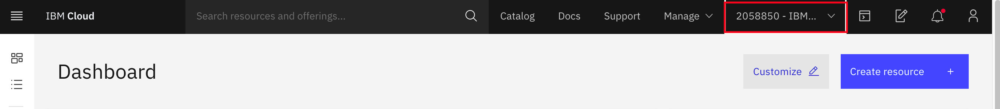

# Lab 3. Using IBM Cloud Block Storage with Kubernetes

## Introduction

When looking at what kind of storage class you would like to use in OpenShift, there are a few choices such as file storage, block storage, object storage, etc. If your use case requires fast and reliable data access then consider block storage.

[Block storage](https://www.ibm.com/cloud/learn/block-storage) is a storage option that breaks data into "blocks" and stores those blocks across a Storage Area Network (SAN). These smaller blocks are faster to store and retrieve than large data objects. For this reason, block storage is primarily used as a backing storage for databases.

In this lab we will deploy a Mongo database on top of block storage on OpenShift.


The basic architecture is as follows

1. When we install MongoDB with the helm chart, a `Persistent Volume Claim` (PVC) is created on the cluster. This PVC is a request for storage to be used by the application.

2. In IBM Cloud, the request goes to the IBM Cloud storage provider which then provisions a physical storage device within IBM Cloud.

3. A `Persistent Volume` (PV) is then created which acts as a reference to the physical storage device created earlier. This PV is then mounted as a directory in a container's file system.

4. The guestbook application receives requests to store guestbook entries from the user which the guestbook pod then sends to the MongoDB pod to store.

5. The MongoDB pod receives the request to store information and persists the data to the mounted directory from the Persistent Volume.

## Setup

Before we get into the lab we first need to do some setup to ensure that the lab will flow smoothly.

1. In your terminal, navigate to where you would like to store the files used in this lab and run the following.

  ```bash
  WORK_DIR=`pwd`
  ```

1. Log into your Openshift cluster locally by following the folloiwng instructions:

#### Login to IBM Cloud

If you are using the [IBM Cloud Shell](https://cloud.ibm.com/shell), you will be already logged into IBM Cloud and you can skip this step.

To login to IBM Cloud,

1. Go to [https://cloud.ibm.com](https://cloud.ibm.com) in your browser and login.

1. Make sure that you are in the `Advowork` account.

    

  >Note: you may not have access to your OpenShift cluster if you are not in the right account#.

#### Shell

Most of the labs are run using CLI commands.

The IBM Cloud Shell available at [https://shell.cloud.ibm.com](https://shell.cloud.ibm.com) is preconfigured with the full IBM Cloud CLI and tons of plug-ins and tools that you can use to manage apps, resources, and infrastructure. 

For those that have never used Helm before, Helm is a package manager for kubernetes applications. We will be able to deploy software such as MongoDB using helm which will then create the necessary kubernetes objects on our cluster.

Helm v3 is already installed in the IBM Cloud shell but an alias needs to be added to use the `helm3` command via the default `helm` command.

```console
$ alias helm=helm3
$ helm version
version.BuildInfo{Version:"v3.2.1", GitCommit:"fe51cd1e31e6a202cba7dead9552a6d418ded79a", GitTreeState:"clean", GoVersion:"go1.13.10"}
```

If you are using the IBM Cloud Shell with the alias, you can skip the rest of the instructions.

To install Helm v3 in other shell clients, run the following commands,

1. In the `Cloud Shell`, download and unzip Helm v3.2.

    ```console
    cd $HOME
    wget https://get.helm.sh/helm-v3.2.0-linux-amd64.tar.gz
    tar -zxvf helm-v3.2.0-linux-amd64.tar.gz
    ```

2. Make Helm v3 CLI available in your `PATH` environment variable.

    ```console
    echo 'export PATH=$HOME/linux-amd64:$PATH' > $HOME/.bash_profile
    source $HOME/.bash_profile
    ```

3. Verify Helm v3 installation.

    ```console
    helm version --short
    ```

    outputs,

    ```console
    $ helm version --short
    v3.2.0+ge11b7ce
    ```

## Login to OpenShift

### Login using the CLI and system:admin User

1. If you cannot access the OpenShift Console and are using the IBM Cloud Shell, list the clusters in your account,

    ```console
    ibmcloud ks clusters
    ```

1. Select your cluster and connect using the OpenShift admin user. You need the right permissions on your user to access your cluster as admin,

    ```console
    $ export CLUSTER_NAME=<cluster name>
    $ ibmcloud ks cluster config -c $CLUSTER_NAME --admin
    The configuration for pnc-roks-lab-027 was downloaded successfully.

    Added context for pnc-roks-lab-027 to the current kubeconfig file.
    ```

### Login Using the OpenShift Console and the IBM Cloud IAM User

1. In a new browser tab, go to [https://cloud.ibm.com/kubernetes/clusters?platformType=openshift](https://cloud.ibm.com/kubernetes/clusters?platformType=openshift).

1. Make sure the `Advowork` account is selected in the dropdown at the top right of the page,

1. Select your cluster instance and open it.

1. Click `OpenShift web console` button on the top.

    

1. Click on your username in the upper right and select `Copy Login Command` option.

    

1. Click the `Display Token` link.

1. Copy the contents of the field `Log in with this token` to the clipboard. It provides a login command with a valid token for your username.

    

1. Go to the your shell terminal.

1. Paste the `oc login command` in the IBM Cloud Shell terminal and run it.

1. Verify you connect to the right cluster.

   ```console
   oc get all
   oc get nodes -o wide
   ```

## Using IBM Cloud Block Storage with OpenShift

Log into the OpenShift cluster and create a project where we want to deploy our application.

  ```bash
  oc new-project mongo
  ```

## Helm Repo setup

The lab uses Bitnami's Mongodb [Helm chart](https://github.com/bitnami/charts/tree/master/bitnami/mongodb) to show case the use of block storage. Set the Bitnami helm repo prior to installing mongodb.

```bash
helm repo add bitnami https://charts.bitnami.com/bitnami
```

Expected output:

```bash
$ helm repo add bitnami https://charts.bitnami.com/bitnami

"bitnami" has been added to your repositories
```

Validate the repo is available in the list.

```bash
helm repo list
```

You should see a list of repos available to you as seen below:

```bash
NAME       URL
bitnami    https://charts.bitnami.com/bitnami
```

## Mongodb with block storage

### Installation Dry Run

Before we install MongoDB, let's do a test of the installation to see what the chart will create. Since we are using Helm to install MongoDB, we can make use of the `--dry-run` flag in our `helm install` command to show us the manifest files that Helm will apply on the cluster.

Dryrun:

```bash
helm install mongo bitnami/mongodb --set global.storageClass=ibmc-block-gold,auth.password=testing,auth.username=guestbookAdmin,auth.database=guestbook -n mongo --dry-run > mongdb-install-dryrun.yaml
```

>There is a detailed breakdown of this command in the next section titled `Installing MongoDB` if you would like to understand what this helm command is doing.

This command will test out our helm install command and save the output manifests in a file called `mongodb-install-dryrun.yaml`. You can then examine this manifest file so that you know exactly what will be installed on your cluster.

Check out the file in your code editor and take a look at the `PersistentVolumeClaim` object. There should be a property named `storageClassName` in the spec and the value should be `ibmc-block-gold` to signify that we will be using block storage for our database.

You can run the following command to view the contents of the `mongodb-install-dryrun.yaml` file to see what will be created on the cluster by helm.

```bash
cat mongdb-install-dryrun.yaml 
```

Below is what that `PersistentVolumeClaim` object should look like. This PersistantVolumeClaim is a request to get access to 8GB of block storage. This storage can be bound to applications to be used as persistent storage, which is what will be done with the MongoDB.

```yaml
kind: PersistentVolumeClaim
apiVersion: v1
metadata:
  name: mongo-mongodb
  namespace: mongo
  labels:
    app.kubernetes.io/name: mongodb
    helm.sh/chart: mongodb-10.0.4
    app.kubernetes.io/instance: mongo
    app.kubernetes.io/managed-by: Helm
    app.kubernetes.io/component: mongodb
spec:
  accessModes:
    - "ReadWriteOnce"
  resources:
    requests:
      storage: "8Gi"
  storageClassName: ibmc-block-gold
```

### Install Mongodb

Before we install MongoDB we need to generate a password for our database credentials. These credentials will be used in the application to authenticate with the database.

For this lab, will be using the [openssl](https://www.openssl.org/) tool to generate the password as this is a common open source cryptographic library. The rest of the command will strip out any characters that could cause issues with the password.

```bash
USER_PASS=`openssl rand -base64 12 | tr -d "=+/"`
```

Now we can install MongoDB and supply the password that we just generated.

``` bash
helm install mongo bitnami/mongodb --set global.storageClass=ibmc-block-gold,auth.password=$USER_PASS,auth.username=guestbook-admin,auth.database=guestbook,containerSecurityContext.enabled=false,podSecurityContext.enabled=false -n mongo
```

Here's an explanation of the above command:

- `helm install mongo bitnami/mongo`: Install the MongoDB bitnami helm chart and name the release "mongo".
- `--set global.storageClass=ibmc-block-gold`: Set the storage class to block storage rather than the default file storage.
- ...`auth.password=$USER_PASS`: Create a custom user with this password (Which we generated earlier).
- ...`auth.username=guestbook-admin`: Create a custom user with this username.
- ...`auth.database=guestbook`: Create a database named `guestbook` that the custom user can authenticate to.
- `-n mongo`: Install this release in the `mongo` namespace.

Expected output:

```bash
NAME: mongo
LAST DEPLOYED: Tue Nov 24 10:41:15 2020
NAMESPACE: mongo
STATUS: deployed
REVISION: 1
TEST SUITE: None
NOTES:
...
```

View the objects being created by the helm chart.

```bash
oc get all -n mongo
```

```bash
NAME                    TYPE        CLUSTER-IP      EXTERNAL-IP   PORT(S)     AGE
service/mongo-mongodb   ClusterIP   172.21.242.70   <none>        27017/TCP   17s

NAME                            READY   UP-TO-DATE   AVAILABLE   AGE
deployment.apps/mongo-mongodb   0/1     0            0           17s

NAME                                       DESIRED   CURRENT   READY   AGE
replicaset.apps/mongo-mongodb-6f8f7cd789   1         0         0       17s
```

View the list of persistence volume claims. Note that the `mongo-mongodb` is pending volume allocation.

```bash
oc get pvc -n mongo
```

```bash
NAME            STATUS    VOLUME   CAPACITY   ACCESS MODES   STORAGECLASS      AGE
mongo-mongodb   Pending                                      ibmc-block-gold   21s
```

After waiting for some time. The pod supporting Mongodb should have a  `Running` status.

```bash
$ oc get all -n mongo
NAME                                 READY   STATUS    RESTARTS   AGE
pod/mongo-mongodb-66d7bcd7cf-vqvbj   1/1     Running   0          8m37s

NAME                    TYPE        CLUSTER-IP      EXTERNAL-IP   PORT(S)     AGE
service/mongo-mongodb   ClusterIP   172.21.242.70   <none>        27017/TCP   12m

NAME                            READY   UP-TO-DATE   AVAILABLE   AGE
deployment.apps/mongo-mongodb   1/1     1            1           12m

NAME                                       DESIRED   CURRENT   READY   AGE
replicaset.apps/mongo-mongodb-66d7bcd7cf   1         1         1       8m37s
replicaset.apps/mongo-mongodb-6f8f7cd789   0         0         0       12m
```

And the PVC `mongo-mongodb` is now bound to volume `pvc-2f423668-4f87-4ae4-8edf-8c892188b645`

```bash
$ oc get pvc -n mongo
NAME            STATUS   VOLUME                                     CAPACITY   ACCESS MODES   STORAGECLASS      AGE
mongo-mongodb   Bound    pvc-2f423668-4f87-4ae4-8edf-8c892188b645   20Gi       RWO            ibmc-block-gold   2m26s
```

With MongoDB deployed now we need to deploy an application that will utilize it as a datastore.

### The Guestbook Application

For this lab we will be using the guestbook application which is a common sample kubernetes application. However, the version that we are using has been refactored as a loopback application.

1. Clone the application repo and the configuration repo. In your terminal, run the following:

  ```bash
  cd $WORK_DIR
  git clone https://github.com/IBM/guestbook-nodejs.git --branch mongo-db
  git clone https://github.com/IBM/guestbook-nodejs-config/ --branch lab
  ```

1. Then, navigate into the `guestbook-nodejs` directory.

  ```bash
  cd $WORK_DIR/guestbook-nodejs/src
  ```

1. Run the following command to view the datasource configuration for our application which is in `server/datasources.json` file

  ```bash
  cat server/datasources.json
  ```

  You should see the following:

  ```json
  {
    "in-memory": {
      "name": "in-memory",
      "localStorage": "",
      "file": "",
      "connector": "memory"
    },
    "mongo": {
      "host": "${MONGO_HOST}",
      "port": "${MONGO_PORT}",
      "url": "",
      "database": "${MONGO_DB}",
      "password": "${MONGO_PASS}",
      "name": "mongo",
      "user": "${MONGO_USER}",
      "useNewUrlParser": true,
      "connector": "mongodb"
    }
  }
  ```

  This file will contain the connection information to our MongoDB instance. These variables will be passed into the environment from ConfigMaps and Secrets that we will create.


1. This application has a file located at `server/model-config.json` that will tell the application which datasource to use. Use the following command to take a look at the file:

  ```bash
  cat server/model-config.json
  ```

  You should see the following section at the bottom of the file:

  ```json
  ...
  "entry": {
      "dataSource": "mongo",
      "public": true
    }
  }
  ```

  In this file we are telling the application which datasource we should use; in-memory or MongoDB. By default the application comes with an in-memory datastore for storing information but this data does not persist after the application crashes or if the pod goes down for any reason. We are using `mongo` so that the data will persist in our MongoDB instance external to the application so that the data will remain even after the application crashes.

### Deploying Guestbook

Now that we have our application, let's check out the manifest files needed to deploy it to OpenShift.

1. Navigate to the configuration repo that we cloned earlier.

  ```bash
  cd $WORK_DIR/guestbook-nodejs-config
  ```

  This repo contains 3 manifests that we will be deploying to our cluster today:

  - A deployment manifest
  - A service manifest
  - A configMap manifest

  These manifests will create their respective kubernetes objects on our cluster.

  The `deployment` will deploy the application that we took a look at earlier as a single container while the `service` will expose that application to external traffic. The `configMap` will contain connection information for our database such as database hostname and port.

1. Let's take a look at the deployment file by running the following command:

  ```bash
  cat guestbook-deployment.yaml
  ```

  You should see the following:

  ```yaml
  apiVersion: apps/v1
  kind: Deployment
  metadata:
    name: guestbook-v1
    labels:
      app: guestbook
      version: "1.0"
  spec:
    replicas: 1
    selector:
      matchLabels:
        app: guestbook
    template:
      metadata:
        labels:
          app: guestbook
          version: "1.0"
      spec:
        containers:
        - name: guestbook
          resources:
            limits:
              cpu: 1
              memory: 512M
          image: odrodrig/guestbook-nodejs:mongo
          imagePullPolicy: Always
          ports:
          - name: http-server
            containerPort: 3000
          env:
            - name: MONGO_HOST
              valueFrom: 
                configMapKeyRef:
                  name: mongo-config
                  key: mongo_host
            - name: MONGO_PORT
              valueFrom:
                configMapKeyRef:
                  name: mongo-config
                  key: mongo_port
            - name: MONGO_USER
              valueFrom:
                secretKeyRef:
                  name: mongodb
                  key: username
            - name: MONGO_PASS
              valueFrom:
                secretKeyRef:
                  name: mongodb
                  key: password
            - name: MONGO_DB
              valueFrom:
                configMapKeyRef:
                  name: mongo-config
                  key: mongo_db_name
  ```

  As part of the deployment, OpenShift will copy the database connection information from the configMap into the environment of the application. You can see where this is specified in the `env` section of the deployment manifest as seen below:

  ```yaml
  ...
  env:
    - name: MONGO_HOST
      valueFrom:
        configMapKeyRef:
          name: mongo-config
          key: mongo_host
    - name: MONGO_PORT
      valueFrom:
        configMapKeyRef:
          name: mongo-config
          key: mongo_port
    - name: MONGO_USER
      valueFrom:
        secretKeyRef:
          name: mongodb
          key: username
    - name: MONGO_PASS
      valueFrom:
        secretKeyRef:
          name: mongodb
          key: password
    - name: MONGO_DB
      valueFrom:
        configMapKeyRef:
          name: mongo-config
          key: mongo_db_name
  ```

  You might also notice that we are getting our database username (`MONGO_USER`) and password (`MONGO_PASS`) from a kubernetes secret. We haven't defined that secret yet so let's do it now.

  ```bash
  oc create secret generic mongodb --from-literal=username=guestbook-admin --from-literal=password=$USER_PASS -n mongo
  ```

1. Now we are ready to deploy the application. Run the following commands:

  ```bash
  cd $WORK_DIR/guestbook-nodejs-config/
  oc apply -f . -n mongo
  ```

  Ensure that the application pod is running:

  ```bash
  oc get pods -n mongo
  ```

  You should see both the mongo pod and the guestbook pod running now:

  ```bash
  NAME                             READY   STATUS    RESTARTS   AGE
  guestbook-v1-9465dcbb4-zdhqv     1/1     Running   0          19s
  mongo-mongodb-757d9777d7-j4759   1/1     Running   0          27m
  ```

### Test out the application

Now that we have deployed the application, let's test it out.

1. Find the URL for the guestbook application by joining the worker node external IP and service node port. Run the following to get the IP and service node port of the application:

```bash
HOSTNAME=`oc get nodes -ojsonpath='{.items[0].metadata.labels.ibm-cloud\.kubernetes\.io\/external-ip}'`
SERVICEPORT=`oc get svc guestbook -n mongo -o=jsonpath='{.spec.ports[0].nodePort}'`
echo "http://$HOSTNAME:$SERVICEPORT"
```

1. In your browser, open up the address that was output as part of the previous command.

1. Type in a few test entries in the text box and press enter to submit them.

  

  These entries are now saved in the Mongo database. Let's take down the application and see if the data will truly persist.

1. Find the name of the pod that is running our application:

  ```bash
  oc get pods -n mongo
  ```

  Copy the name of the pod that starts with `guestbook`. For me, the pod is named `guestbook-v1-9465dcbb4-f6s9h`.

  ```bash
  NAME                             READY   STATUS    RESTARTS   AGE
  guestbook-v1-9465dcbb4-f6s9h     1/1     Running   0          4m7s
  mongo-mongodb-757d9777d7-q64lg   1/1     Running   0          5m47s
  ```

1. Then, run the following command, replacing `<pod name>` with pod name that you just copied.

  ```bash
  oc delete pod -n mongo <pod name>
  ```

  You should then see a message saying that your pod has been deleted.

  ```bash
  $ oc delete pod -n mongo guestbook-v1-9465dcbb4-f6s9h
  pod "guestbook-v1-9465dcbb4-f6s9h" deleted
  ```

1. Now, view your pods again:

  ```bash
  oc get pods -n mongo
  ```

  You should see the guestbook pod is back now with and the age has been reset. This means that it is a brand new pod that OpenShift has deployed automatically after our previous pod was deleted.

  ```bash
  NAME                             READY   STATUS    RESTARTS   AGE
  guestbook-v1-9465dcbb4-8z8bt     1/1     Running   0          87s
  mongo-mongodb-757d9777d7-q64lg   1/1     Running   0          9m13s
  ```

1. Refresh your browser tab that had the guestbook application and you will see that your data has indeed persisted after our pod went down.


## Summary

In this lab we used block storage to run our own database on OpenShift. Block storage allows for fast I/O operations making it ideal for our application database. We utilized configMaps and secrets to store the database configuration making it easy to use this application with different database configurations without making code changes.

## Cleanup (Optional)

This part of the lab desrcibes the steps to delete what was built in the lab.

### Deleting the application

```bash
cd $WORK_DIR/guestbook-nodejs-config
oc delete -f . -n mongo
```

### Uninstalling Mongo

```bash
helm uninstall mongo -n mongo
```

### Remove namespace

```bash
oc delete namespace mongo
```
