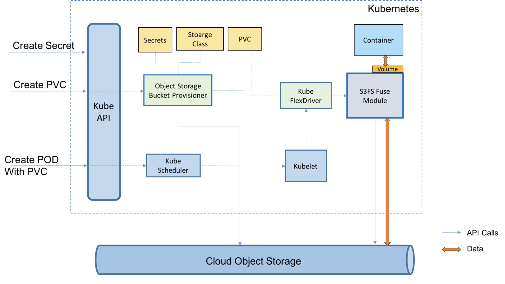

# Lab 5: Add Object Storage to a Persistent Database

## About this Lab

This hands-on lab for object storage on Kubernetes is called `Add Object Storage to a Persistent Database` and steps you through the setup and configuration of persistent storage for MongoDB using IBM Cloud Object Storage. This lab uses the [IBM Cloud Object Storage plugin](https://github.com/IBM/ibmcloud-object-storage-plugin) to mount an Object Storage bucket to a Kubernetes cluster using `PersistentVolume` by `dynamic provisioning`. A MongoDB database is setup that persists its data to the encrypted `IBM Cloud Object Storage` bucket using a `PersistentVolumeClaim`.

`IBM Cloud Object Storage plugin` is a Kubernetes volume plugin that enables Kubernetes pods to access `IBM Cloud Object Storage` buckets. The plugin has two components: a dynamic provisioner and a FlexVolume driver for mounting the buckets using `s3fs-fuse` on a worker node.

`FlexVolume` is a so-called `out-of-tree` volume plugin, as is the `Container Storage Interface (CSI)`. `Out-of-tree` volume plugins enable storage developers to create custom storage plugins. For more information about `FlexVolume`, go to [flexvolume](../../flexvolume/README.md).

[`s3fs`](https://github.com/s3fs-fuse/s3fs-fuse) allows Linux and macOS to mount an S3 bucket via FUSE. If you want to learn more about `s3fs-fuse` and FUSE you can do the optional [s3fs lab](../fuse/README.md).

The lab consists of the following steps:

1. Setup client CLI and Kubernetes cluster, Go to [Setup](../setup/README.md),
1. Create an Object Storage instance, go to [Object Storage](COS.md),
1. Configure the Kubernetes cluster, go to [Configure your Kubernetes Cluster](CLUSTER.md),
1. Deploy and configure the `IBM Cloud Object Storage plugin`, go to [Cloud Object Storage plugin](COS-PLUGIN.md),
1. Create a `PersistentVolumeClaim` with dynamic provisioning using the `ibmc` plugin, go to [Create the PersistentVolumeClaim](PVC.md).
1. Install MongoDB with Object Storage, go to [MongoDB](MONGODB.md).

Start with [Setup](../setup/README.md).

## Other Labs

Related labs using Object Storage are:

* [Optional] (TBD) Deploy Guestbook with MongoDB and Object Storage.
* [Share Documents using Cloud Object Storage](share-docs-with-cos/README.md).
* [Mount a Remote Object Storage as Local Filesystem in Userspace (FUSE) with S3FS](../fuse/README.md)

## Next

[1. Setup](../setup/README.md)
