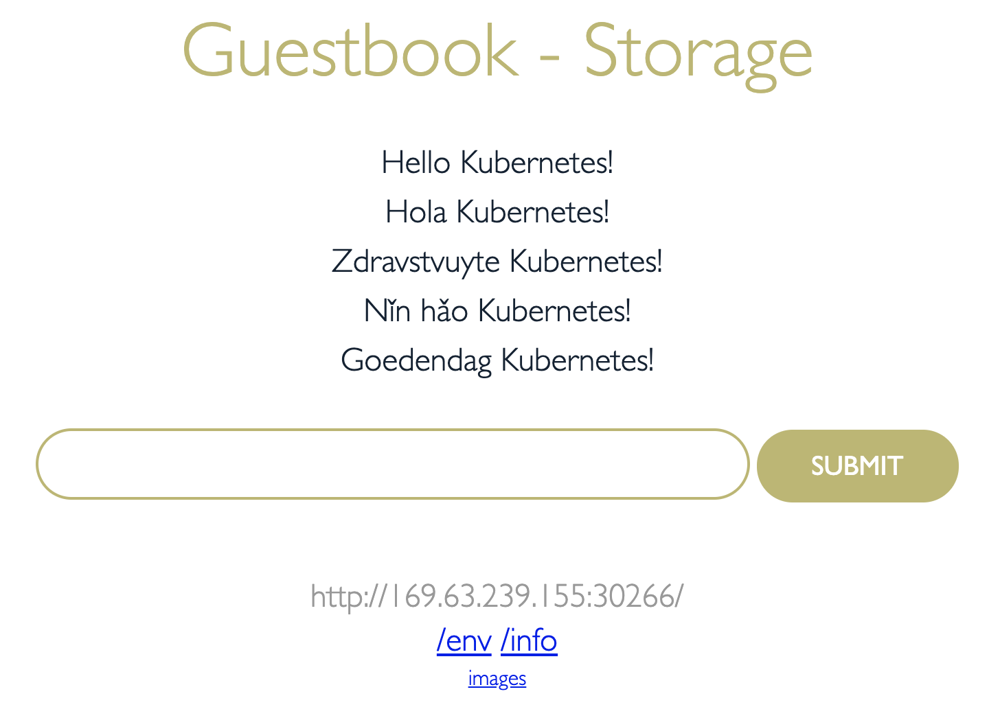
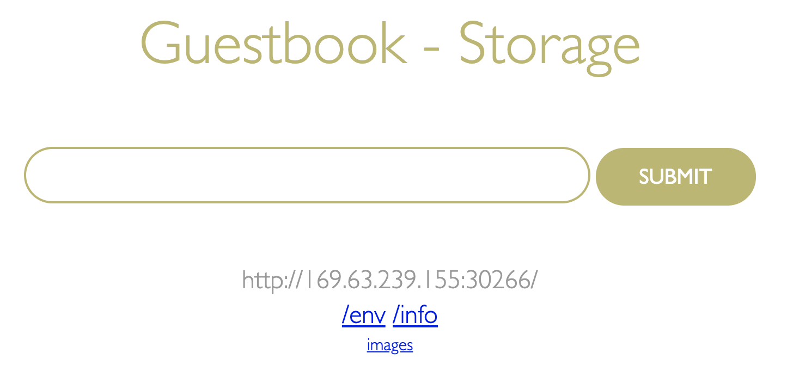
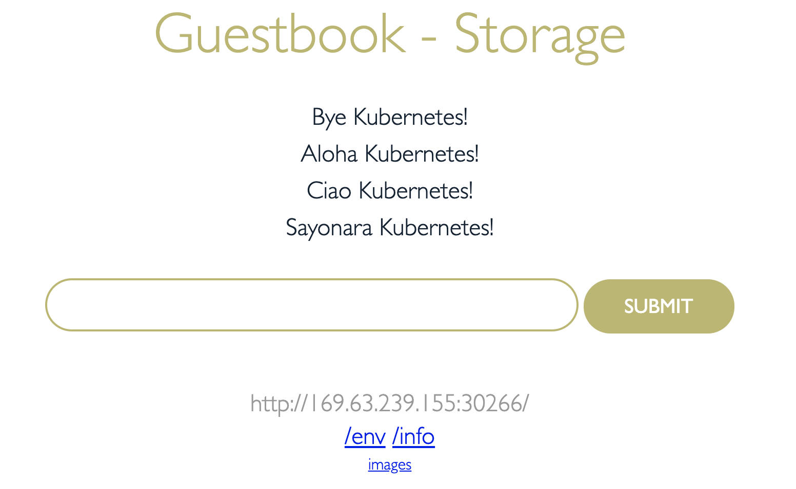

# Lab 1: Non-persistent storage with Kubernetes

Storing data in containers or worker nodes are considered as the [non-persistent](https://kubernetes.io/docs/concepts/configuration/manage-resources-containers/#local-ephemeral-storage) forms of data storage.
In this lab, we will explore storage options on the IBM Kubernetes worker nodes. Follow this [lab](https://github.com/remkohdev/docker101/tree/master/workshop/lab-3) is you are interested in learning more about container-based storage.

The lab covers the following topics:

- Create and claim IBM Kubernetes [non-persistent](https://cloud.ibm.com/docs/containers?topic=containers-storage_planning#non_persistent_overview) storage based on the primary and secondary storage available on the worker nodes.
- Make the volumes available in the `Guestbook` application.
- Use the volumes to store application cache and debug information.
- Access the data from the guestbook container using the Kubernetes CLI.
- Assess the impact of losing a pod on data retention.
- Claim back the storage resources and clean up.

The primary storage maps to the volume type `hostPath` and the secondary storage maps to `emptyDir`. Learn more about Kubernetes volume types [here](https://Kubernetes.io/docs/concepts/storage/volumes/).

## Reserve Persistent Volumes

From the cloud shell prompt, run the following commands to get the guestbook application and the kubernetes configuration needed for the storage labs.

```bash
cd $HOME
git clone --branch fs https://github.com/IBM/guestbook-nodejs.git
git clone --branch storage https://github.com/rojanjose/guestbook-config.git
cd $HOME/guestbook-config/storage/lab1
```

Let's start with reserving the Persistent volume from the primary storage.
Review the yaml file `pv-hostpath.yaml`. Note the values set for `type`, `storageClassName` and `hostPath`.

```yaml
apiVersion: v1
kind: PersistentVolume
metadata:
  name: guestbook-primary-pv
  labels:
    type: local
spec:
  storageClassName: manual
  capacity:
    storage: 10Gi
  accessModes:
    - ReadWriteOnce
  hostPath:
    path: "/mnt/data"
```

Create the persistent volume as shown in the command below:

```bash
kubectl create -f pv-hostpath.yaml
persistentvolume/guestbook-primary-pv created

kubectl get pv
NAME                                       CAPACITY   ACCESS MODES   RECLAIM POLICY   STATUS      CLAIM                   STORAGECLASS       REASON   AGE
guestbook-primary-pv                       10Gi       RWO            Retain           Available                           manual                      13s
```

Next
PVC yaml:

```yaml
apiVersion: v1
kind: PersistentVolumeClaim
metadata:
 name: guestbook-local-pvc
spec:
  storageClassName: manual
  accessModes:
    - ReadWriteMany
  resources:
    requests:
      storage: 3Gi
```

Create PVC:

```bash
kubectl create -f pvc-hostpath.yaml
persistentvolumeclaim/guestbook-local-pvc created
❯ kubectl get pvc
NAME                  STATUS   VOLUME                                     CAPACITY   ACCESS MODES   STORAGECLASS       AGE
guestbook-local-pvc   Bound    guestbook-local-pv                         10Gi       RWX            manual             6s
```

## Guestbook application using storage

The application is the [Guestbook App](https://github.com/IBM/guestbook-nodejs), which is a simple multi-tier web application built using the loopback framework.

Change to the guestbook application source directory:

```bash
cd $HOME/guestbook-nodejs/src
```

Review the source `common/models/entry.js`. The application uses storage allocated using `hostPath` to store data cache in the file `data/cache.txt`. The file `logs/debug.txt` records debug messages provisioned using the `emptyDir` storage type.

```javascript
module.exports = function(Entry) {

    Entry.greet = function(msg, cb) {

        // console.log("testing " + msg);
        fs.appendFile('logs/debug.txt', "Received message: "+ msg +"\n", function (err) {
            if (err) throw err;
            console.log('Debug stagement printed');
        });

        fs.appendFile('data/cache.txt', msg+"\n", function (err) {
            if (err) throw err;
            console.log('Saved in cache!');
        });

...
```

Run the commands listed below to build the guestbook image and copy into the docker hub registry:

```bash
docker build -t $DOCKERUSER/guestbook-nodejs:storage .
docker login -u $DOCKERUSER
docker push $DOCKERUSER/guestbook-nodejs:storage
```

Review the deployment yaml file `guestbook-deplopyment.yaml` prior to deploying the application into the cluster.

```bash
cd $HOME/guestbook-config/storage/lab1
cat guestbook-deployment.yaml
```

Replace the first part of `image` name with your docker hub user id.
The section `spec.volumes` lists `hostPath` and `emptyDir` volumes. The section `spec.containers.volumeMounts` lists the mount paths that the application uses to write in the volumes.

```yaml
apiVersion: apps/v1
kind: Deployment
metadata:
  name: guestbook-v1
  labels:
    app: guestbook
 ...
    spec:
      containers:
        - name: guestbook
          image: rojanjose/guestbook-nodejs:storage
          imagePullPolicy: Always
          ports:
          - name: http-server
            containerPort: 3000
          volumeMounts:
          - name: guestbook-primary-volume
            mountPath: /home/node/app/data
          - name: guestbook-secondary-volume
            mountPath: /home/node/app/logs
      volumes:
      - name: guestbook-primary-volume
        persistentVolumeClaim:
          claimName: guestbook-primary-pvc
      - name: guestbook-secondary-volume
        emptyDir: {}

...
```

Deploy the Guestbook application:

```bash
kubectl create -f guestbook-deployment.yaml
deployment.apps/guestbook-v1 created

kubectl get pods
NAME                            READY   STATUS    RESTARTS   AGE
guestbook-v1-6f55cb54c5-jb89d   1/1     Running   0          14s

kubectl create -f guestbook-service.yaml
service/guestbook created
```

Find the URL for the guestbook application by joining the worker node external IP and service node port.

```bash
HOSTNAME=`kubectl get nodes -o wide | tail -n 1 | awk '{print $7}'`
SERVICEPORT=`kubectl get svc guestbook -o=jsonpath='{.spec.ports[0].nodePort}'`
echo "http://$HOSTNAME:$SERVICEPORT"
```

Open the URL in a browser and create guest book entries.



Next, inspect the data. To do this, run a bash process inside the application container using `kubectl exec`. Reference the pod name from the previous `kubectl get pods` command. Once inside the container, use the subsequent comands to inspect the data.

```bash
kubectl exec -it [POD NAME] -- bash

root@guestbook-v1-6f55cb54c5-jb89d:/home/node/app# ls -al
total 256
drwxr-xr-x   1 root root   4096 Nov 11 23:40 .
drwxr-xr-x   1 node node   4096 Nov 11 23:20 ..
-rw-r--r--   1 root root     12 Oct 29 21:00 .dockerignore
-rw-r--r--   1 root root    288 Oct 29 21:00 .editorconfig
-rw-r--r--   1 root root      8 Oct 29 21:00 .eslintignore
-rw-r--r--   1 root root     27 Oct 29 21:00 .eslintrc
-rw-r--r--   1 root root    151 Oct 29 21:00 .gitignore
-rw-r--r--   1 root root     30 Oct 29 21:00 .yo-rc.json
-rw-r--r--   1 root root    105 Oct 29 21:00 Dockerfile
drwxr-xr-x   2 root root   4096 Nov 11 03:40 client
drwxr-xr-x   3 root root   4096 Nov 10 23:04 common
drwxr-xr-x   2 root root   4096 Nov 11 23:16 data
drwxrwxrwx   2 root root   4096 Nov 11 23:44 logs
drwxr-xr-x 439 root root  16384 Nov 11 23:20 node_modules
-rw-r--r--   1 root root 176643 Nov 11 23:20 package-lock.json
-rw-r--r--   1 root root    830 Nov 11 23:20 package.json
drwxr-xr-x   3 root root   4096 Nov 10 23:04 server

root@guestbook-v1-6f55cb54c5-jb89d:/home/node/app# cat data/cache.txt
Hello Kubernetes!
Hola Kubernetes!
Zdravstvuyte Kubernetes!
Nǐn hǎo Kubernetes!
Goedendag Kubernetes!

root@guestbook-v1-6f55cb54c5-jb89d:/home/node/app# cat logs/debug.txt
Received message: Hello Kubernetes!
Received message: Hola Kubernetes!
Received message: Zdravstvuyte Kubernetes!
Received message: Nǐn hǎo Kubernetes!
Received message: Goedendag Kubernetes!


root@guestbook-v1-6f55cb54c5-jb89d:/home/node/app# df -h
Filesystem               Size  Used Avail Use% Mounted on
overlay                   98G  3.5G   90G   4% /
tmpfs                     64M     0   64M   0% /dev
tmpfs                    7.9G     0  7.9G   0% /sys/fs/cgroup
/dev/mapper/docker_data   98G  3.5G   90G   4% /etc/hosts
shm                       64M     0   64M   0% /dev/shm
/dev/xvda2                25G  3.6G   20G  16% /home/node/app/data
tmpfs                    7.9G   16K  7.9G   1% /run/secrets/kubernetes.io/serviceaccount
tmpfs                    7.9G     0  7.9G   0% /proc/acpi
tmpfs                    7.9G     0  7.9G   0% /proc/scsi
tmpfs                    7.9G     0  7.9G   0% /sys/firmware

```

While still inside the container, create a file on the container file system. This file will not persist when we kill the container. Then run `/sbin/killall5` to terminate the container.

```bash
root@guestbook-v1-6f55cb54c5-jb89d:/home/node/app# touch dontdeletemeplease
root@guestbook-v1-6f55cb54c5-jb89d:/home/node/app# ls dontdeletemeplease
dontdeletemeplease
root@guestbook-v1-66798779d6-fqh2j:/home/node/app# /sbin/killall5
root@guestbook-v1-66798779d6-fqh2j:/home/node/app# command terminated with exit code 137
```

The `killall5` command will kick you out of the container (which is no longer running), but the pod is still running. Verify this with `kubectl get pods`. Not the **0/1** status indicating the application container is no longer running.

```bash
kubectl get pods
NAME                            READY   STATUS             RESTARTS   AGE
guestbook-v1-66798779d6-fqh2j   0/1     CrashLoopBackOff   2          16m
```

After a few seconds, the Pod will restart the container:

```bash
kubectl get pods
NAME                            READY   STATUS    RESTARTS   AGE
guestbook-v1-66798779d6-fqh2j   1/1     Running   3          16m
```

Run a bash process inside the container to inspect your data again:

```bash
kubectl exec -it [POD NAME] -- bash

root@guestbook-v1-6f55cb54c5-jb89d:/home/node/app# cat data/cache.txt
Hello Kubernetes!
Hola Kubernetes!
Zdravstvuyte Kubernetes!
Nǐn hǎo Kubernetes!
Goedendag Kubernetes!

root@guestbook-v1-6f55cb54c5-jb89d:/home/node/app# cat logs/debug.txt
Received message: Hello Kubernetes!
Received message: Hola Kubernetes!
Received message: Zdravstvuyte Kubernetes!
Received message: Nǐn hǎo Kubernetes!
Received message: Goedendag Kubernetes!


root@guestbook-v1-6f55cb54c5-jb89d:/home/node/app# ls dontdeletemeplease
ls: dontdeletemeplease: No such file or directory

```

Notice how the storage from the primary (`hostPath`) and secondary (`emptyDir`) storage types persisted beyond the lifecycle of the container, but the `dontdeletemeplease` file, did not.

Next, we'll kill the pod to see the impact of deleting the pod on data.

```bash
kubectl get pods
NAME                            READY   STATUS    RESTARTS   AGE
guestbook-v1-6f55cb54c5-jb89d   1/1     Running   0          12m

kubectl delete pod guestbook-v1-6f55cb54c5-jb89d
pod "guestbook-v1-6f55cb54c5-jb89d" deleted

kubectl get pods
NAME                            READY   STATUS    RESTARTS   AGE
guestbook-v1-5cbc445dc9-sx58j   1/1     Running   0          86s
```



Enter new data:


Log into the pod to view the state of the data.

```bash
kubectl get pods
NAME                            READY   STATUS    RESTARTS   AGE
guestbook-v1-5cbc445dc9-sx58j   1/1     Running   0          86s

kubectl exec -it guestbook-v1-5cbc445dc9-sx58j bash
kubectl exec [POD] [COMMAND] is DEPRECATED and will be removed in a future version. Use kubectl kubectl exec [POD] -- [COMMAND] instead.

root@guestbook-v1-5cbc445dc9-sx58j:/home/node/app# cat data/cache.txt
Hello Kubernetes!
Hola Kubernetes!
Zdravstvuyte Kubernetes!
Nǐn hǎo Kubernetes!
Goedendag Kubernetes!
Bye Kubernetes!
Aloha Kubernetes!
Ciao Kubernetes!
Sayonara Kubernetes!

root@guestbook-v1-5cbc445dc9-sx58j:/home/node/app# cat logs/debug.txt
Received message: Bye Kubernetes!
Received message: Aloha Kubernetes!
Received message: Ciao Kubernetes!
Received message: Sayonara Kubernetes!
root@guestbook-v1-5cbc445dc9-sx58j:/home/node/app#
```

This shows that the storage type `emptyDir` loose data on a pod restart whereas `hostPath` data lives until the worker node or cluster is deleted.

| Storage Type  |  Persisted at which level | Example  Uses
| - | - | - |
| Container local storage | Container | ephermal state
| Secondary Storage ([EmptyDir](https://kubernetes.io/docs/concepts/storage/volumes/#emptydir)) | Pod | Checkpoint a long computation process
| Primary Storage ([HostPath](https://kubernetes.io/docs/concepts/storage/volumes/#hostpath)) | Node | Running cAdvisor in a container

Normally Kubernetes clusters have multiple worker nodes in a cluster with replicas for a single application running across different worker nodes. In this case, only applications running on the same worker node will share data persisted with IKS Primary Storage (HostPath). More suitable solutions are available for cross worker nodes, cross availability-zone and cross-region storage.

## Clean up

```bash
cd $HOME/guestbook-config/storage/lab1
kubectl delete -f .
```
