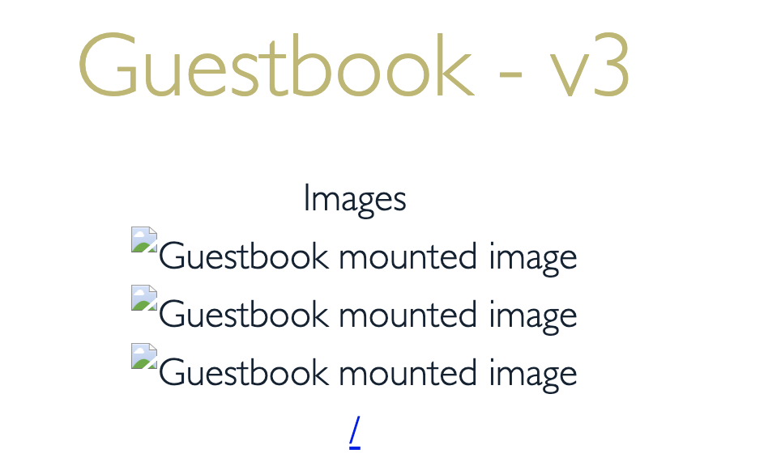

# Lab 2: File storage with Kubernetes

This lab demonstrates the use of cloud based file storage with Kubernetes. It uses the IBM Cloud File Storage which is persistent, fast, and flexible network-attached, NFS-based File Storage capacity ranging from 25 GB to 12,000 GB capacity with up to 48,000 IOPS. The IBM Cloud File Storage provides data across all worker nodes within a single availability zone.

Following topics are covered in this exercise:

- Claim a classic file storage volume.
- Make the volumes available in the `Guestbook` application.
- Copy media files such as images into the volume using the Kubernetes CLI.
- Use the `Guestbook` application to view the images.
- Claim back the storage resources and clean up.

## Prereqs

Follow the [prereqs](../Lab0/README.md) if you haven't already.

## Claim file storage volume

Review the [storage classes](https://cloud.ibm.com/docs/containers?topic=containers-file_storage#file_storageclass_reference) for file storage. In addition to the standard set of storage classes, [custom storage classes](https://cloud.ibm.com/docs/containers?topic=containers-file_storage#file_custom_storageclass) can be defined to meet the storage requirements.

```bash
kubectl get storageclasses
```

Expected output:

```bash
$ kubectl get storageclasses

default                    ibm.io/ibmc-file   Delete          Immediate           false                  27m
ibmc-file-bronze           ibm.io/ibmc-file   Delete          Immediate           false                  27m
ibmc-file-bronze-gid       ibm.io/ibmc-file   Delete          Immediate           false                  27m
ibmc-file-custom           ibm.io/ibmc-file   Delete          Immediate           false                  27m
ibmc-file-gold (default)   ibm.io/ibmc-file   Delete          Immediate           false                  27m
ibmc-file-gold-gid         ibm.io/ibmc-file   Delete          Immediate           false                  27m
ibmc-file-retain-bronze    ibm.io/ibmc-file   Retain          Immediate           false                  27m
ibmc-file-retain-custom    ibm.io/ibmc-file   Retain          Immediate           false                  27m
ibmc-file-retain-gold      ibm.io/ibmc-file   Retain          Immediate           false                  27m
ibmc-file-retain-silver    ibm.io/ibmc-file   Retain          Immediate           false                  27m
ibmc-file-silver           ibm.io/ibmc-file   Delete          Immediate           false                  27m
ibmc-file-silver-gid       ibm.io/ibmc-file   Delete          Immediate           false                  27m
```

IKS comes with storage class definitions for file storage. This lab uses the storage class `ibm-file-silver`. Note that the default class is `ibmc-file-gold` is allocated if storgage class is not expliciity definded.

```bash
kubectl describe storageclass ibmc-file-silver
```

Expected output:

```bash
$ kubectl describe storageclass ibmc-file-silver

Name:            ibmc-file-silver
IsDefaultClass:  No
Annotations:     kubectl.kubernetes.io/last-applied-configuration={"apiVersion":"storage.k8s.io/v1","kind":"StorageClass","metadata":{"annotations":{},"labels":{"kubernetes.io/cluster-service":"true"},"name":"ibmc-file-silver"},"parameters":{"billingType":"hourly","classVersion":"2","iopsPerGB":"4","sizeRange":"[20-12000]Gi","type":"Endurance"},"provisioner":"ibm.io/ibmc-file","reclaimPolicy":"Delete"}

Provisioner:           ibm.io/ibmc-file
Parameters:            billingType=hourly,classVersion=2,iopsPerGB=4,sizeRange=[20-12000]Gi,type=Endurance
AllowVolumeExpansion:  <unset>
MountOptions:          <none>
ReclaimPolicy:         Delete
VolumeBindingMode:     Immediate
Events:                <none>
```

File sliver has an IOPS of 4GB and a max capacity of 12TB.

## Claim a file storage volume

IBM Cloud File Storage provides fast access to your data for a cluster running in a single available zone. For higher availability, use a storage option that is designed for [geographically distributed data](https://cloud.ibm.com/docs/containers?topic=containers-storage_planning#persistent_storage_overview).

Review the yaml for the file storage `PersistentVolumeClaim`. When we create this `PersistentVolumeClaim`, it automatically creates it within an availability zone where the worker nodes are located.

```bash
cd guestbook-config/storage/lab2
cat pvc-file-silver.yaml

apiVersion: v1
kind: PersistentVolumeClaim
metadata:
 name: guestbook-pvc
 labels:
   billingType: hourly
spec:
 accessModes:
   - ReadWriteMany
 resources:
   requests:
     storage: 20Gi
 storageClassName: ibmc-file-silver
```

Create the PVC

```bash
kubectl apply -f pvc-file-silver.yaml
```

Expected output:

```bash
$ kubectl create -f pvc-file-silver.yaml
persistentvolumeclaim/guestbook-filesilver-pvc created
```

Verify the PVC claim is created with the status `Bound`. This may take a minute or two.

```bash
kubectl get pvc guestbook-filesilver-pvc
```

Expected output:

```bash
$ kubectl get pvc guestbook-filesilver-pvc
NAME                       STATUS   VOLUME                                     CAPACITY   ACCESS MODES   STORAGECLASS       AGE
guestbook-filesilver-pvc   Bound    pvc-a7cb12ed-b52b-4342-966a-eceaf24e42a9   20Gi       RWX            ibmc-file-silver   2m
```

Details associated with the `pv`. Use the `pv` name from the previous command output.

```bash
kubectl get pv [pv name]
```

Expected output:

```bash
$ kubectl get pv pvc-a7cb12ed-b52b-4342-966a-eceaf24e42a9
NAME                                       CAPACITY   ACCESS MODES   RECLAIM POLICY   STATUS   CLAIM                              STORAGECLASS       REASON   AGE
pvc-a7cb12ed-b52b-4342-966a-eceaf24e42a9   20Gi       RWX            Delete           Bound    default/guestbook-filesilver-pvc   ibmc-file-silver            90s
```

## Use the volume in the Guestbook application

Change to the guestbook application source directory and review the html files `images.html` and `index.html`. `images.html` has the code to display the images stored in the file storage.

```bash
cd $HOME/guestbook-nodejs/src
cat client/images.html
cat client/index.html
```

Run the commands listed below to build the guestbook image and copy into the docker hub registry:
(Skip this step if you have already completed lab 1.)

```bash
cd $HOME/guestbook-nodejs/src
docker build -t $DOCKERUSER/guestbook-nodejs:storage .
docker login -u $DOCKERUSER
docker push $DOCKERUSER/guestbook-nodejs:storage
```

Review the deployment yaml file `guestbook-deplopyment.yaml` prior to deploying the application into the cluster.

```bash
cd $HOME/guestbook-config/storage/lab2
cat guestbook-deployment.yaml
```

Replace the first part of the `image` name with your docker hub user id.
The section `spec.volumes` references the `file`  volume PVC. The section `spec.containers.volumeMounts` has the mount path to store images in the volumes.

```yaml
apiVersion: apps/v1
kind: Deployment
metadata:
  name: guestbook-v1
...
    spec:
      containers:
        - name: guestbook
          image: rojanjose/guestbook-nodejs:storage
          imagePullPolicy: Always
          ports:
          - name: http-server
            containerPort: 3000
          volumeMounts:
          - name: guestbook-file-volume
            mountPath: /app/public/images
      volumes:
      - name: guestbook-file-volume
        persistentVolumeClaim:
          claimName: guestbook-filesilver-pvc
```

Deploy the Guestbook application.

```bash
kubectl create -f guestbook-deployment.yaml
kubectl create -f guestbook-service.yaml
```

Verify the Guestbook application is runing.

```bash
kubectl get all
```

Expected output:

```bash
$ kubectl get all
NAME                                READY   STATUS    RESTARTS   AGE
pod/guestbook-v1-5bd76b568f-cdhr5   1/1     Running   0          13s
pod/guestbook-v1-5bd76b568f-w6h6h   1/1     Running   0          13s

NAME                 TYPE           CLUSTER-IP      EXTERNAL-IP      PORT(S)          AGE
service/guestbook    LoadBalancer   172.21.238.40   150.238.30.150   3000:31986/TCP   6s
service/kubernetes   ClusterIP      172.21.0.1      <none>           443/TCP          9d

NAME                           READY   UP-TO-DATE   AVAILABLE   AGE
deployment.apps/guestbook-v1   2/2     2            2           13s

NAME                                      DESIRED   CURRENT   READY   AGE
replicaset.apps/guestbook-v1-5bd76b568f   2         2         2       13s
```

Check the mount path inside the pod container. Get the pod listing.

```bash
$ kubectl get pods
NAME                            READY   STATUS    RESTARTS   AGE
guestbook-v1-5bd76b568f-cdhr5   1/1     Running   0          78s
guestbook-v1-5bd76b568f-w6h6h   1/1     Running   0          78s
```

Set these variables for each of your pod names:

```bash
export POD1=[FIRST POD NAME]
export POD2=[SECOND POD NAME]
```

Log into any one of the pod. Use one of the pod names from the previous command output.

```bash
kubectl exec -it $POD1 -- bash
```

Run the commands `ls -al; ls -al images; df -ah` to view the volume and files. Review the mount for the new volume. Note that the images folder is empty.

```bash
$ kubectl exec -it $POD1 -- bash
root@guestbook-v1-5bd76b568f-cdhr5:/home/node/app# ls -alt
total 252
drwxr-xr-x   1 root root   4096 Nov 13 03:17 client
drwxr-xr-x   1 root root   4096 Nov 13 03:15 .
drwxr-xr-x 439 root root  16384 Nov 13 03:15 node_modules
-rw-r--r--   1 root root 176643 Nov 13 03:15 package-lock.json
drwxr-xr-x   1 node node   4096 Nov 13 03:15 ..
-rw-r--r--   1 root root    830 Nov 11 23:20 package.json
drwxr-xr-x   3 root root   4096 Nov 10 23:04 common
drwxr-xr-x   3 root root   4096 Nov 10 23:04 server
-rw-r--r--   1 root root     12 Oct 29 21:00 .dockerignore
-rw-r--r--   1 root root    288 Oct 29 21:00 .editorconfig
-rw-r--r--   1 root root      8 Oct 29 21:00 .eslintignore
-rw-r--r--   1 root root     27 Oct 29 21:00 .eslintrc
-rw-r--r--   1 root root    151 Oct 29 21:00 .gitignore
-rw-r--r--   1 root root     30 Oct 29 21:00 .yo-rc.json
-rw-r--r--   1 root root    105 Oct 29 21:00 Dockerfile

root@guestbook-v1-5bd76b568f-cdhr5:/home/node/app# ls -alt client/images
total 8
drwxr-xr-x 1 root   root       4096 Nov 13 03:17 ..
drwxr-xr-x 2 nobody 4294967294 4096 Nov 13 02:02 .

root@guestbook-v1-5bd76b568f-cdhr5:/home/node/app# df -h
Filesystem                                                         Size  Used Avail Use% Mounted on
overlay                                                             98G  4.9G   89G   6% /
tmpfs                                                               64M     0   64M   0% /dev
tmpfs                                                              7.9G     0  7.9G   0% /sys/fs/cgroup
shm                                                                 64M     0   64M   0% /dev/shm
/dev/mapper/docker_data                                             98G  4.9G   89G   6% /etc/hosts
tmpfs                                                              7.9G   16K  7.9G   1% /run/secrets/kubernetes.io/serviceaccount
fsf-dal1003d-fz.adn.networklayer.com:/IBM02SEV2058850_2177/data01   20G     0   20G   0% /home/node/app/client/images
tmpfs                                                              7.9G     0  7.9G   0% /proc/acpi
tmpfs                                                              7.9G     0  7.9G   0% /proc/scsi
tmpfs                                                              7.9G     0  7.9G   0% /sys/firmware

root@guestbook-v1-5bd76b568f-cdhr5:/home/node/app# exit
```

Note the filesystem `fsf-dal1003d-fz.adn.networklayer.com:/IBM02SEV2058850_2177/data01` is mounted on path `/home/node/app/client/images`.

Find the URL for the guestbook application by joining the worker node external IP and service node port.

```bash
HOSTNAME=`kubectl get nodes -ojsonpath='{.items[0].metadata.labels.ibm-cloud\.kubernetes\.io\/external-ip}'`
SERVICEPORT=`kubectl get svc guestbook -o=jsonpath='{.spec.ports[0].nodePort}'`
echo "http://$HOSTNAME:$SERVICEPORT"
```

Verify that the images are missing by viewing the data from the Guestbook application. Click on the hyperlink labled `images` at the bottom of the guestbook home page. The images.html page shows images with broken links.



## Load the file storage with images

Run the `kubectl cp` command to move the images into the mounted volume.

```bash
cd $HOME/guestbook-config/storage/lab2
kubectl cp images $POD1:/home/node/app/client/
```

Refresh the page `images.html` page in the guestbook application to view the uploaded images.


## Shared storage across pods

Login into the other pod `$POD2` to verify the volume mount.

```bash
kubectl exec -it $POD2 -- bash
root@guestbook-v1-5bd76b568f-w6h6h:/home/node/app# ls -alt /home/node/app/client/images
total 160
-rw-r--r-- 1    501 staff      56191 Nov 13 03:44 gb3.jpg
drwxr-xr-x 2 nobody 4294967294  4096 Nov 13 03:44 .
-rw-r--r-- 1    501 staff      21505 Nov 13 03:44 gb2.jpg
-rw-r--r-- 1    501 staff      58286 Nov 13 03:44 gb1.jpg
drwxr-xr-x 1 root   root        4096 Nov 13 03:17 ..

root@guestbook-v1-5bd76b568f-w6h6h:/home/node/app# df -h
Filesystem                                                         Size  Used Avail Use% Mounted on
overlay                                                             98G  4.2G   89G   5% /
tmpfs                                                               64M     0   64M   0% /dev
tmpfs                                                              7.9G     0  7.9G   0% /sys/fs/cgroup
shm                                                                 64M     0   64M   0% /dev/shm
/dev/mapper/docker_data                                             98G  4.2G   89G   5% /etc/hosts
tmpfs                                                              7.9G   16K  7.9G   1% /run/secrets/kubernetes.io/serviceaccount
fsf-dal1003d-fz.adn.networklayer.com:/IBM02SEV2058850_2177/data01   20G  128K   20G   1% /home/node/app/client/images
tmpfs                                                              7.9G     0  7.9G   0% /proc/acpi
tmpfs                                                              7.9G     0  7.9G   0% /proc/scsi
tmpfs                                                              7.9G     0  7.9G   0% /sys/firmware

root@guestbook-v1-5bd76b568f-w6h6h:/home/node/app# exit
```

Note that the volume and the data are available on all the pods running the Guestbook application.

IBM Cloud File Storage is a NFS-based file storage that is available across all worker nodes within a single availability zone. If you are running a cluster with multiple nodes (within a single AZ) you can run the following commands to prove that your data is available across different nodes:

```bash
kubectl get pods -o wide
kubectl get nodes
```

Expected output:

```bash
$ kubectl get pods -o wide
NAME                            READY   STATUS    RESTARTS   AGE   IP               NODE            NOMINATED NODE   READINESS GATES
guestbook-v1-6fb8b86876-n9jtz   1/1     Running   0          39h   172.30.224.70    10.38.216.205   <none>           <none>
guestbook-v1-6fb8b86876-njwcz   1/1     Running   0          39h   172.30.169.144   10.38.216.238   <none>           <none>

$ kubectl get nodes
NAME            STATUS   ROLES    AGE    VERSION
10.38.216.205   Ready    <none>   4d5h   v1.18.10+IKS
10.38.216.238   Ready    <none>   4d5h   v1.18.10+IKS
```

To extend our table from Lab 1 we now have:

| Storage Type  |  Persisted at which level | Example  Uses
| - | - | - |
| Container local storage | Container | ephermal state
| Secondary Storage ([EmptyDir](https://kubernetes.io/docs/concepts/storage/volumes/#emptydir)) | Pod | Checkpoint a long computation process
| Primary Storage ([HostPath](https://kubernetes.io/docs/concepts/storage/volumes/#hostpath)) | Node | Running cAdvisor in a container
| IBM Cloud File Storage (NFS) | Availabilty Zone | Applications running in a single availabilty zone

Data is available to all nodes within the availability zone where the file storage exists, but the `accessMode` parameter on the `PersistentVolumeClaim` determines if multiple pods are able to mount a volume specificed by a PVC. The possible values for this parameter are:

- **ReadWriteMany**: The PVC can be mounted by multiple pods. All pods can read from and write to the volume.
- **ReadOnlyMany**: The PVC can be mounted by multiple pods. All pods have read-only access.
- **ReadWriteOnce**: The PVC can be mounted by one pod only. This pod can read from and write to the volume.

## [Optional exercises]

Another way to see that the data is persisted at the availability zone level, you can:

- Back up data.
- Delete pods to confirm that it does not impact the data used by the application.
- Delete the Kubernetes cluster.
- Create a new cluster and reuse the volume.

## Clean up

List all the PVCs and PVs

```bash
kubectl get pvc
kubectl get pv
```

Delete all the pods using the PVC.
Delete the PVC

```bash
kubectl delete pvc guestbook-pvc

persistentvolumeclaim "guestbook-pvc" deleted
```

List PV to ensure that it is removed as well.
Cancel the physical storage volume from the cloud account. (Note: requires admin permissions?)

```bash
ibmcloud sl file volume-list --columns id  --columns notes | grep pvc-6362f614-258e-48ee-a596-62bb4629cd75

183223942   {"plugin":"ibm-file-plugin-7b9db9c79f-86x8w","region":"us-south","cluster":"bugql3nd088jsp8iiagg","type":"Endurance","ns":"default","pvc":"guestbook-pvc","pv":"pvc-6362f614-258e-48ee-a596-62bb4629cd75","storageclass":"ibmc-file-silver","reclaim":"Delete"}


ibmcloud sl file volume-cancel 183223942

This will cancel the file volume: 183223942 and cannot be undone. Continue?> yes
Failed to cancel file volume: 183223942.
No billing item is found to cancel.
```
