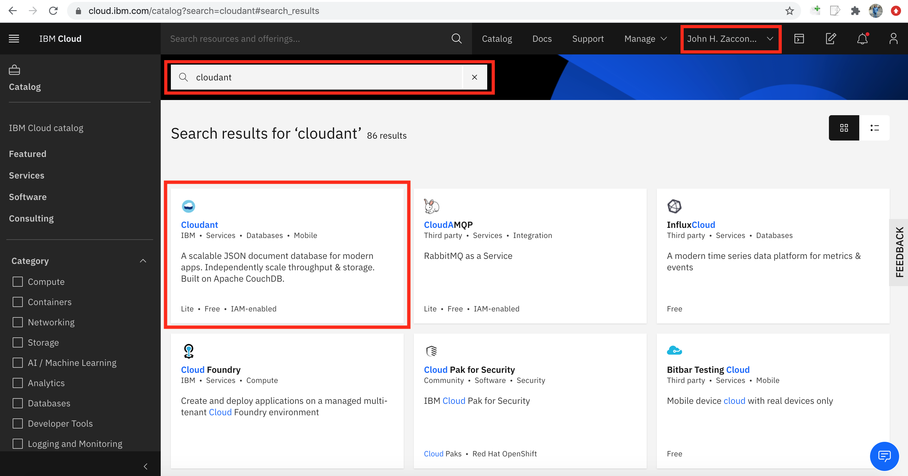
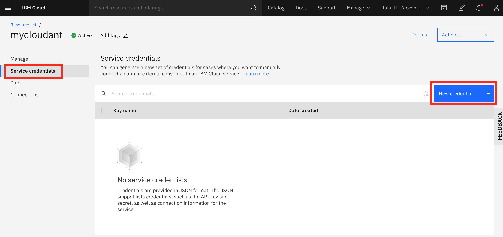
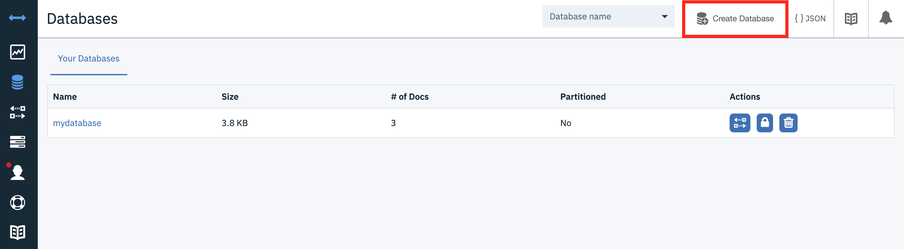

# Lab 7. Connecting to External Storage

This lab configures our nodejs guestbook Application to connect to an external database - outside of the kubernetes cluster in which the guestbook app is deployed. We will be using a managed database service offered on IBM Cloud. The advantages of using a database service is that scaling, security, etc are often taken care of for you, but you can apply this lab to any external database service such as a legacy database you might have running on premise.

Two options to setting up the database service

- [Approach 1](#Approach-1:-Manually-create-database-service-on-IBM-Cloud-console)
- [Approach 2](#-Approach-2:-Use-the-IBM-Cloud-Operator-to-provision-a-database-instance-on-IBM-Cloud)

## Approach 1: Manually create database service on IBM Cloud console

### Create a Cloudant DB service

In these steps will be using a free `lite` CloudantDB on IBM Cloud using your free IBM Cloud account. [Create an account](https://cloud.ibm.com/registration) if you haven't already.

Navigate to the [IBM Cloud Catalog](https://cloud.ibm.com/catalog). Make sure your personal account in selected in the dropdown in the upper right. Select the Cloudant tile.



Set the instance name to "mycloudant". Ensure the "Lite" plan is selected. Then hit create.


### Create a credential for your CloudantDB service

Locate your credentials in your CloudantDB service on IBM Cloud. From the Cloudant DB service, select **Service Credentials** on the left. Then click the blue **New credential** on the right.



Select the default name and role (should be `manager`) for the credentials, and click **Create**.

Expand the credential and take note of the **url** parameter. We will be using this value to populate a Kubernetes secret in the next step.

### Save your credentials in a Kubernetes `secret`

    ```
    kubectl create secret generic cloudant-binding --from-literal=CLOUDANT_URL=[CLOUDANT_URL]
    ```

Once completed, [skip ahead to the next section](##Next-Steps)

## Approach 2: Use the IBM Cloud Operator to provision a database instance on IBM Cloud

The Operator Framework provides support for Kubernetes-native extensions to manage custom resource types through operators. Many operators are available through [operatorhub.io](https://operatorhub.io/), including the IBM Cloud operator. The IBM Cloud operator simplifies the creation of IBM Cloud services and resouces and binding credentials from these resources into a Kubernetes cluster. The instructions in this guide are adapted from the IBM Developer tutorial [Simplify the lifecycle management process for your Kubernetes apps with operators](https://developer.ibm.com/tutorials/simplify-lifecycle-management-kubernetes-openshift-ibm-cloud-operator/).

With the IBM Cloud Kubernetes Service clusters at version 1.16 and later, the Operator Framework is already installed. So all you will need to do is install the IBM Cloud Operator. New clusters created after March 1st, 2020 should all be at this level (or later).

### Create an API Key for your Target Account

We will configure the IBM Cloud Operator to maange resources on your personal IBM Cloud Account. You will be able to create and manage a Cloudant DB lite service that only you will have access to.

1. Login to your personal IBM Cloud account. Use `--sso` if using single-sign-on. Select your personal account when asked upon logging in.

    ```bash
    ibmcloud login
    ```

    ```bash
    $ ibmcloud login
    API endpoint: https://cloud.ibm.com
    Region: us-south
    Authenticating...
    OK

    Select an account:
    1. John H. Zaccone's Account (a21524842fc807640e69bf89c00009fc)
    2. Another Account (12345)
    Enter a number> 1
    Targeted account John H. Zaccone's Account (a21524842fc807640e69bf89c00009fc)

    API endpoint:      https://cloud.ibm.com
    Region:            us-south
    User:              John.Zaccone@ibm.com
    Account:           John H. Zaccone's Account (a21524842fc807640e69bf89c00009fc)
    Resource group:    No resource group targeted, use 'ibmcloud target -g RESOURCE_GROUP'
    CF API endpoint:
    Org:
    ```

1. Create a service ID in IBM Cloud IAM. If possible, do not use spaces in the names for your IAM credentials. When you use the operator binding feature, any spaces are replaced with underscores.

    ```bash
    ibmcloud iam service-id-create serviceid-ico
    ```

1. Assign the service ID access to the required permissions to work with the IBM Cloud services. You will need the **Manager** role to provision a Cloudant service.

    ```bash
    ibmcloud iam service-policy-create serviceid-ico --roles Manager --resource-group-name default --region us-south
    ```

1. Create an API key for the service ID.

    ```bash
    ibmcloud iam service-api-key-create apikey-ico serviceid-ico
    ```

1. Set the API key of the service ID as your CLI environment variable. Now, when you run the installation script, the script uses the service ID's API key. The following command is an example for macOS.

    ```bash
    export IBMCLOUD_API_KEY=<apikey-ico-value>
    ```

1. Confirm that the API key environment variable is set in your CLI.

    ```bash
    echo $IBMCLOUD_API_KEY
    ```

### Installing the IBM Cloud operator

1. Follow the setup steps in [Lab0](../Lab0/README.md) if necessary to point your `kubectl` command-line tool to your Kubernetes cluster.

    ```bash
    ibmcloud login
    ```

1. Target the default resource group that your service ID has privledges to.

    ```bash
    ibmcloud target -g default
    ```

1. The operator marketplace catalog provides a URL for the resources to install for each operator. Install the IBM Cloud Operator with the following command:

    ```bash
    curl -sL https://raw.githubusercontent.com/IBM/cloud-operators/master/hack/configure-operator.sh | bash -s -- install
    ```

    Check that the pod for the IBM Cloud operator is running with:

    ```bash
    kubectl get pods --namespace ibm-system
    ```

    You should see after a minute or two that the pod for the operator is running:

    ```bash
    $ kubectl get pods --all-namespaces
    NAMESPACE                  NAME                                                    READY   STATUS    RESTARTS   AGE
    ibmcloud-operator-system   ibmcloud-operator-controller-manager-56c8548f89-stzdq   2/2     Running   0          14m
    ```

### Understanding Operators

The [Operator Pattern](https://kubernetes.io/docs/concepts/extend-kubernetes/operator/) is an emerging approach to extend through automation the expertise of human operators into the cluster environment. Operators are intended to support applications and management of other resources in and related to kubernetes clusters starting at installation, but continuing to day 2 operations of monitoring, backup, fault recovery and, of course, updates.

Operators are custom code that uses the Kubernetes API (as a client) to implement a controller for a [**Custom Resource**](https://kubernetes.io/docs/concepts/extend-kubernetes/api-extension/custom-resources/). Unlike the controllers built into the Kubernetes control plane which run on the Kubernetes master node, operators run outside of the Kubernetes control plan as pods on the worker nodes in the cluster. You can verify that fact by the `kubectl get pods` command above, which lists the pods of the operator running on a worker node.

In addition to the IBM Cloud Operator, there are many operators that can manage resources within your cluster available from the [Operator Hub](https://operatorhub.io). The Operator Hub includes many useful operators including operators that implement database installation, monitoring tools, application development frameworks, application runtimes and more.

Your cluster now has the IBM Cloud operator installed. This operator is able to configure two custom resources in the cluster, a **Service** and a **Binding**. The **Service** defines a specific IBM Cloud service instance type to create, and the **Binding** specifies a named binding of a service instance to a secret in the cluster. For more details about the IBM Cloud operator see the [project repository](https://github.com/IBM/cloud-operators)

### Creating an instance of Cloudant

For an application running within a Kubernetes cluster to be able to access an IBM Cloud service, the service needs to be created and the credentials to access the service must be added to the cluster so that they can be read by deployed applications. The Kubernetes cluster running the application accessing the service instance can be anywhere, but in this case you'll be using your Kubernetes cluster on IBM Cloud. We will be using a Cloudant DB service on IBM Cloud for this lab because it is free, json document datastore that will be easy for us to swap from our previous MongoDB database connection.

### Create the service instance and bind to the cluster

1. Change into the `yaml` directory. apply the `cloudant-ibmcloud.yaml` file.

    ```bash
    cd $HOME/kube-storage101/src/yaml
    ```

1. Apply the `cloudant-ibmcloud.yaml` file using kubectl. This file defines a **Service** and **Binding** resource:

    ```bash
    kubectl apply -f cloudant-ibmcloud.yaml
    ```

    This file defines a **Service** and **Binding** resource and if successful there will be confirmation for both:

    ```bash
    $ kubectl apply -f cloudant-ibmcloud.yaml
    service.ibmcloud.ibm.com/mycloudant created
    binding.ibmcloud.ibm.com/binding-cloudant created
    ```

1. Check for the secret for the CloudantDB service instance added to the current namespace:

    ```bash
    kubectl get secret binding-cloudant
    ```

    You should see confirmation of the secret, but there may be a short delay as the credentials are obtained by the operator, so repeat this command until you no longer see an error like: *Error from server (NotFound): secrets "binding-cloudant" not found*

    ```bash
    $ kubectl get secret binding-cloudant
    NAME           TYPE      DATA      AGE
    binding-cloudant   Opaque    6         40s
    ```

    With the credentials added to the current namespace, you will be able to deploy guestbook application that uses the analyzer microservice. But first, let's do a little checking of the actions by the IBM Cloud operator.

### Debug

    If the credentials have not been created after a few moments, check the logs of the kubernetes object you created.

    ```
    kubectl describe service.ibmcloud.ibm.com/mycloudant
    ```

### Check the IBM Cloud console - verify the Cloudant DB service

You can return to your IBM Cloud console and see that the tone analyzer service was created as specified in the `cloudant-ibmcloud.yaml` resource file.

1. Go back to your IBM Cloud tab in the browser and click on the words **IBM Cloud** on the upper left of the top menu. Now your Dashboard view will show a Services item under the **Resource summary**. Click on the **Services** label, and search for `mycloudant` to find your newly created instance

    

1. Click on the **mycloudant** label in the Services list. This will open up the control panel for the IBM CloudantDB service.

1. Click on the **Service Credentials** label and expands the service credential listed to see your service API Key - make a note of it or just keep the credentials visible.

    

1. Return to the *Kubernetes Terminal* tab in your web browser and enter this command to extract and decode the apikey from the secret created by the IBM Cloud Operator:

    ```bash
    kubectl get secret binding-cloudant -o=jsonpath='{.data.apikey}' | base64 -d && echo
    ```

    Notice how the string displayed is exactly the same as the service API Key visible from the control panel for the service.

### Lifecycle management with the IBM Cloud operator

Let's take a look at the custom resource definition (CRD) file that was used in this exercise (`cloudant-ibmcloud.yaml`).

    ```yaml
    apiVersion: ibmcloud.ibm.com/v1alpha1
    kind: Service
    metadata:
    name: mycloudant
    spec:
    plan: lite
    serviceClass: cloudantnosqldb
    ---
    apiVersion: ibmcloud.ibm.com/v1alpha1
    kind: Binding
    metadata:
    name: binding-cloudant
    spec:
    serviceName: mycloudant
    role: Manager
    ```

Note that the API version is different from what you may have seen in other resource files in this lab. Since Kubernetes objects are scoped by the API, there's no conflict with the re-use of the `kind` **Service** in this CRD. Recall that in the internal Kubernetes API, a resource of `kind` **Service** is used to expose network ports running on pods. Here, the **Service** object type is used to descibe an IBM Cloud platform service from the catalog. The operator uses the `spec` of the resource to select the desired IBM Cloud service type and offering plan.

The role of the IBM Cloud operator is to manage instances of these services and also create a **Binding** to the service that is stored as a secret in the cluster.
The operator will monitor the IBM Cloud account service instances. If something happens to the service instance, the operator will detect the change and take action. For example, if a the service instance is deleted, the operator will create a new service instance and update the credentials stored in the binding secret.

## Next Steps

Regardless of whether you did approach 1 or approach 2, the end result is the same. You should now have a CloudantDB service created on IBM Cloud with credentials to that service saved inside your Kubernetes as a `secret`. The next steps walk you through

1) Create a new database on the CloudantDB Service
1) Modify the guestbook application to read from CloudantDB
1) Build and push a new guestbook docker image
1) Edit the Kubernetes deployment yaml files to pull the new version of the application AND the credentials saved in the secret
1) Check your changes by deploying to Kubernetes and testing the application

### Create a new database on the CloudantDB service

From your newly created Cloudant service on the IBM Cloud console, click "launch dashboard"


Use your IBM Credentials to login if necessary. From the Cloudant Dashboard screen, click "Create Database" and give it name, such as "mydatabase"



Remember this name as we will be using it later when we deploy our application.

### Modify the guestbook application to read from CloudantDB

You will have to make minor changes to the Guestbook nodejs application to read from your newly created CloudantDB service.

Download the guestbook application if you haven't already.

    ```
    git clone https://github.com/IBM/guestbook-nodejs
    ```

(Optional) Install the [Loopback connector](https://loopback.io/doc/en/lb2/Cloudant-connector.html) for CloudantDB. This has been done for you already.

    ```
    cd guestbook-nodejs/src
    npm install loopback-connector-cloudant --save
    ```

The connector provides the boilerplate code to connect to different backends. All we have to do is provide some basic configuration.

Define the Cloudant as a datasource by installing src/server/datasources.json file with the following:

    ```json
    {
        "in-memory": {
            "name": "in-memory",
            "localStorage": "",
            "file": "",
            "connector": "memory"
        },
        "cloudant": {
            "name": "cloudant",
            "connector": "cloudant",
            "url" : "${CLOUDANT_URL}",
            "database" : "${CLOUDANT_DB}"
        }
    }
    ```

The environment variables `CLOUDANT_URL` and `CLOUDANT_DB` will be loaded in our environment via our Kubernetes Deployment. You can also hardcode these values if you would like to test locally.

Reference the datasource you just created in `src/server/model-config.json` as seen below:

    ```json
    "entry": {
        "dataSource": "cloudant",
        "public": true
    }
    ```

### Build and push a new docker image

In order to deploy to kubernetes, we will need a Docker Image saved to a registry somewhere. In this lab, we will build an image locally and push directly to DockerHub. In real-life, we would use CI/CD process to build and push our docker image from source control.

Prereqs: [Create a Docker Hub Account](https://hub.docker.com)

Build the docker image

    ```bash
    IMAGE_NAME=[dockerhub username]/guestbook-nodejs:[version tag]
    docker build -t $IMAGE_NAME
    docker push $IMAGE_NAME
    ```

Your guestbook application is all set to talk to a Cloudant database. Next, we will configure our Kubernetes deployment to use the image you just pushed, and to load the missing environment variables: `CLOUDANT_URL` and `CLOUDANT_DB` from our `binding-cloudant` secret.

### Configure Kubernetes yamls

We have a yaml file create for you, but you will need to enter the location of the Docker Image you built in the previous step.

Replace `[IMAGE_NAME]` in the file [guestbook-deployment-cloudant.yaml](https://github.com/IBM/kube-storage101/blob/master/src/yaml/guestbook-deployment-cloudant.yaml) with the name of the image you uploaded to Docker Hub. Replace `[DB_NAME]` with the name of the Cloudant Database your created in a previous step. Your final yaml file should look like this:

    ```yaml
    apiVersion: apps/v1
    kind: Deployment
    metadata:
    name: guestbook-cloudant
    labels:
        app: guestbook
    spec:
    selector:
        matchLabels:
        app: guestbook
    template:
        metadata:
        labels:
            app: guestbook
        spec:
        containers:
        - name: guestbook
            image: [IMAGE_NAME]
            resources:
            requests:
                cpu: 100m
                memory: 100Mi
            ports:
            - name: http
            containerPort: 3000
            env:
            - name: CLOUDANT_URL
            valueFrom:
                secretKeyRef:
                name: binding-cloudant
                key: url
            - name : CLOUDANT_DB
            value: "[DB_NAME]"
    ```

Notice how we load the environment variable `CLOUDANT_URL` from the `binding-cloudant` secreat that we created for us by the IBM Cloud Operator. This yaml files now defines all the environment variables our guestbook application needs to connect to our Cloudant DB.

### Test your changes by deploying to Kubernetes

Deploy to kubernetes using `kubectl apply`:

    ```bash
    kubectl apply -f [deployment file]
    kubectl apply -f [service file]
    ```
