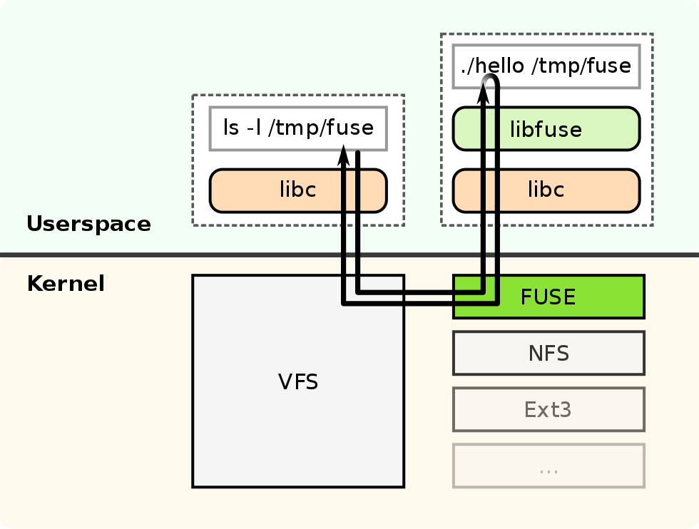
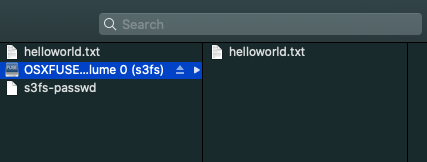
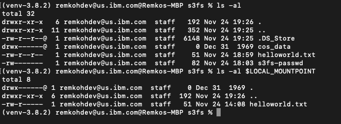

# Mount a Remote Object Storage as Local Filesystem in Userspace (FUSE) with S3FS

## About FUSE

[Filesystem in Userspace (FUSE)](https://en.wikipedia.org/wiki/Filesystem_in_Userspace) lets non-privileged users create a file system in their user space. The FUSE project consists of two components: a FUSE kernel module that is part of the Linux kernel since version 2.6.14, and the `libfuse` userspace library. The [`libfuse` library](https://github.com/libfuse/libfuse) provides a reference implementation for communication with the FUSE kernel module, providing client functions to mount the file system, unmount it, read requests from the kernel, and send responses back. FUSE is particularly useful for writing Virtual File Systems (VFS).



### s3fs

If you want to use Object Storage as the underlying storage for FUSE-based filesystem disk management, you can use [`s3fs` or `s3fs-fuse`](https://github.com/s3fs-fuse/s3fs-fuse). `s3fs` is an Amazon S3 (Services Simple Storage) and S3-based object stores compatible utility for FUSE-based filesystem disk management that supports a subset of [Single UNIX Specification (SUS)](https://en.wikipedia.org/wiki/Single_UNIX_Specification) or [POSIX](https://en.wikipedia.org/wiki/POSIX) including reading/writing files, directories, symlinks, mode, uid/gid, and extended attributes, while preserving the original file format, e.g. a plain text or MS Word document.

Applications that need to read and write to an NFS-style filesystem can use s3fs, which integrates applications with S3 compatible storage like [IBM Cloud Object Storage](https://cloud.ibm.com/docs/cloud-object-storage). s3fs also allows you to interact with your cloud storage using familiar shell commands, like `ls` for listing or `cp` to copy files.

Performance is not equal to a true local filesystem, but you can use some advanced options to increase throughput. Object storage services have high-latency for time to first byte and lack `random write` access (requires rewriting the full object). Workloads that only read big files, like deep learning workloads, can achieve good throughput using s3fs.

s3fs on macOS uses [`osxfuse`](https://osxfuse.github.io/). osxfuse is FUSE for macOS.

## Lab

In this lab, you will [mount a bucket using s3fs](https://cloud.ibm.com/docs/cloud-object-storage?topic=cloud-object-storage-s3fs). You need admin access to install `s3fs-fuse`. In this lab, I used `brew` on macOS, for other Operating Systems, see the [installation instructions](https://github.com/s3fs-fuse/s3fs-fuse).

Pre-requirements:

* A free IBM Cloud account,
* A free IBM Cloud Object Storage (COS) instance with a bucket,
* Admin access to your client OS,

### Connect to IBM Cloud

You have to be logged in to your IBM Cloud account,

```console
ibmcloud login -u <IBMId>
```

If you are using Single Sign-On (SSO) use the `-sso` flag to log in.

Select the account with your instance of Object Storage. In the example below, I have to select account **1** under my own name, e.g. `B Newell's Account',

```console
Select an account:
    1. B Newell's Account (31296e3a285f)
    2. IBM Client Developer Advocacy (e65910fa61) <-> 1234567
    Enter a number> **1**
    Targeted account B Newell's Account (31296e3a285f)
```

Then, set an environment variable with the bucket name, and upload a document to your bucket in the IBM Cloud Object Storage instance.

```console
COS_NAME=<cos-instance-name>
COS_BUCKET_NAME=<cos-bucket-name>
```

### Upload an Object to Object Storage

Create a new document,

```console
COS_OBJECT_KEY=helloworld.txt
echo "Hello World! Today is $(date)" > $COS_OBJECT_KEY
```

[Upload an object using S3Manager](https://cloud.ibm.com/docs/cli?topic=cloud-object-storage-cli-plugin-ic-cos-cli#ic-upload-s3manager),

```console
ibmcloud cos upload --bucket $COS_BUCKET_NAME --key $COS_OBJECT_KEY --file ./helloworld.txt --content-language en-US --content-type "text/plain"

OK
Successfully uploaded object 'helloworld.txt' to bucket 'e59a327194-cos-1-bucket1'.
```

### Install s3fs

Install `s3fs`,

```console
brew install s3fs
```

If you already have credentials with HMAC keys created for your Object Storage instance, you can retrieve credentials using,

```console
ibmcloud resource service-keys --output json
```

Set an environment variable `COS_CREDENTIALS` with the name of the credentials,

```console
COS_CREDENTIALS=$(ibmcloud resource service-keys --output json | jq -r '.[0].credentials.iam_apikey_name')
```

If you do not have credentials yet, create credentials for your IBM Cloud Object Storage instance with HMAC keys,

```console
ibmcloud resource service-key-create $COS_CREDENTIALS Writer --instance-name $COS_NAME --parameters '{"HMAC":true}'
```

Will create credentials including among other HMAC keys,

```console
"cos_hmac_keys": {
    "access_key_id": "c407e90c41c3463b8e7722048aa48edc",
    "secret_access_key": "0f8c2cb6ef82c63d8d1f935a8ef6a87fe1bc16ed1ba8483c"
},
```

Create environment variables with the HMAC keys from the first credentials listed in your `service-keys` list. Change the index value if you have multiple `service-keys` or credentials. Create an S3FS password file,

```console
COS_ACCESS_KEY=$(ibmcloud resource service-key $COS_CREDENTIALS --output json | jq -r '.[0].credentials.cos_hmac_keys.access_key_id')
COS_SECRET_KEY=$(ibmcloud resource service-key $COS_CREDENTIALS --output json | jq -r '.[0].credentials.cos_hmac_keys.secret_access_key')

COS_S3FS_PASSWORD_FILE=s3fs-passwd
echo $COS_ACCESS_KEY:$COS_SECRET_KEY > $COS_S3FS_PASSWORD_FILE
chmod 0600 $COS_S3FS_PASSWORD_FILE
```

### Mount Local File System

Mount the local directory using S3FS,

```console
mkdir cos_data
LOCAL_MOUNTPOINT=$(pwd)/cos_data
COS_PUBLIC_ENDPOINT=s3.us-south.cloud-object-storage.appdomain.cloud

s3fs $COS_BUCKET_NAME -o passwd_file=$(pwd)/$COS_S3FS_PASSWORD_FILE -o url=https://$COS_PUBLIC_ENDPOINT $LOCAL_MOUNTPOINT
```

You should see the content of your IBM Cloud Object Storage, e.g using the Finder on macos



or using the cli on macos,



If you are using a bucket mounted to a MongoDB instance using `s3fs-fuse`, you will also see a directory `data/db` with all the MongoDB database files mounted to your local filesystem.

### References

* [Mounting a bucket using s3fs](https://cloud.ibm.com/docs/cloud-object-storage?topic=cloud-object-storage-s3fs)
